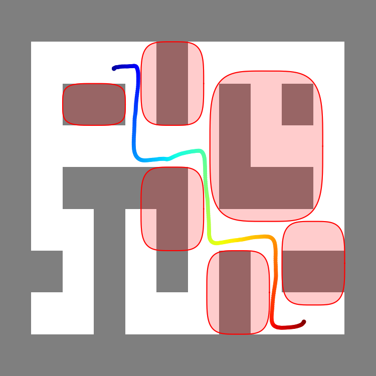
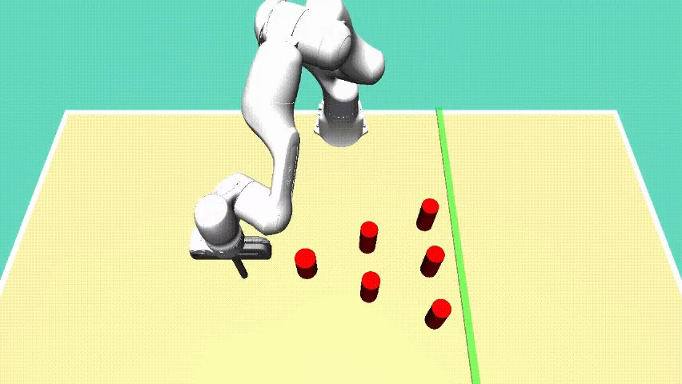
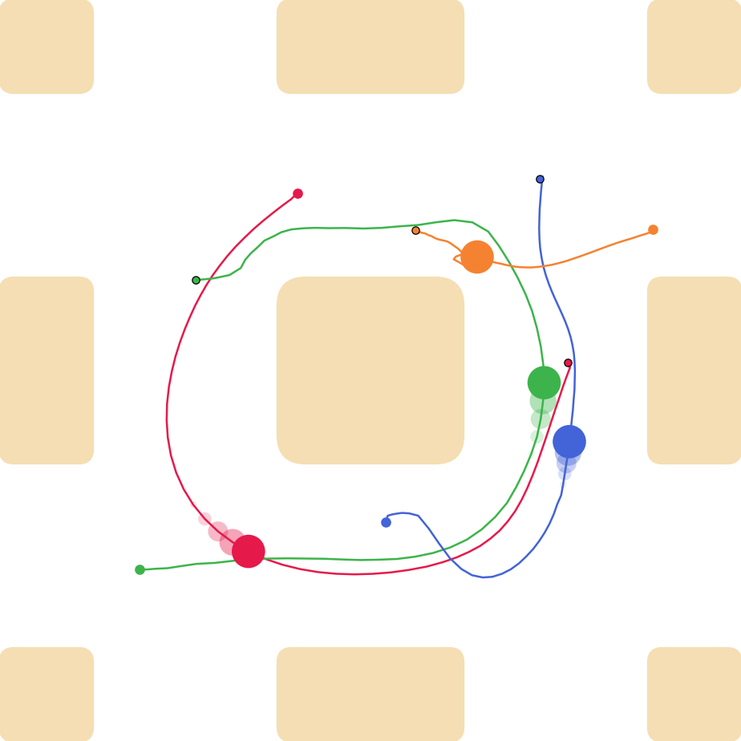
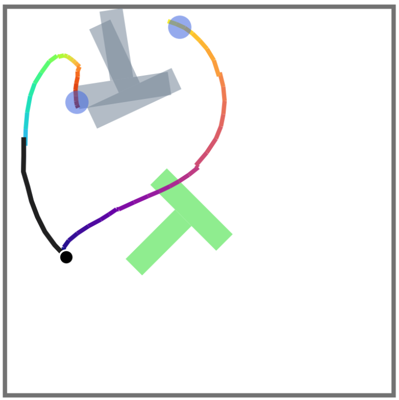

# DiRecT: Safe Diffusion-Based Planning via Receding-Horizon Denoising

[](https://arxiv.org/abs/xxxx.xxxxx)
[](https://opensource.org/licenses/MIT)

[Paolo Giaretta](https://github.com/GiarettaPaolo)<sup>1,2</sup>
[Zeyang Li](https://github.com/zeyang23)<sup>1</sup>
[Navid Azizan](https://github.com/azizanlab)<sup>1</sup>

<sup>1</sup>Laboratory for Information and Decision Systems (LIDS), Massachusetts Institute of Technology (MIT); <br>
<sup>2</sup>École Polytechnique Fédérale de Lausanne (EPFL);

This repo contains the code for training and evaluation of the _DiRecT_ benchmarks presented in the paper.

## 📢 Introduction 
We introduce _DiRecT_ (**Di**ffusion-based planning via **Rec**eding-horizon denoising with **T**erminal constraints), a training-free algorithm for constrained sampling from diffusion models via stochastic optimal control (SOC). We evaluate _DiRecT_ on diverse robotic planning applications, including [maze navigation](maze2d) in Maze2D, [robotic manipulation](d3il) in D3IL, [multi-robot motion planning](multi_robot) (MRMP), and [diverse contact-rich manipulation](pusht) in PushT. Across these tasks, _DiRecT_ consistently improves constraint satisfaction and task success over existing diffusion-based planning baselines.

<table>
  <tr>
    <td align="center">
      <br>
      <sub>Maze2D</sub>
    </td>
    <td align="center">
      <br>
      <sub>D3IL</sub>
    </td>
    <td align="center">
      <br>
      <sub>MRMP</sub>
    </td>
    <td align="center">
      <br>
      <sub>PushT</sub>
    </td>
  </tr>
</table>

See specific instructions for each benchmark in the respective folders:
- Maze navigation with _test-time_ obstacle and dynamics constraints on [Maze2D](maze2d/README.md).
- Robotic manipulation with _test-time_ obstacle and dynamics constraints on [D3IL Avoiding](d3il/README.md).
- Multi-Robot Motion Planning with _test-time_ velocity and collision constraints on the four [MMD environments](multi_robot/README.md).
- Diverse contact-rich manipulation with _test-time_ velocity limits on [PushT](pusht/README.md). 

## ⚙️ Algorithm
We repeat a simplified version of the algorithm. Please, refer at the paper for the full derivation and implementation details.

```text
Algorithm: DiRecT — Safe diffusion-based planning

Input:
  score model s_t^θ, cost C, cost weight λ > 0, feasible set S,
  denoising steps N, time grid {t_i}, sampler Φ_i^θ,
  affine scheduler (α_t, σ_t)

Output:
  safe plan X_0*

1. Sample prior:
     X_N* ~ N(0, I_d)

2. For i = N, ..., 1:

     Δt_i ← t_i - t_{i-1}
     ε_i  ~ N(0, I_d)

     g_i ← diffusion coefficient from the scheduler

     X̄_{i-1}^{ε_i} ← Φ_i^θ(X_i*, ε_i)               # uncontrolled denoising proposal

     X̃_{0|i-1} ← x̂_0^θ(X̄_{i-1}^{ε_i}, t_{i-1})      # Tweedie clean-sample estimate

     Solve Optimization:
       X̂*_{0|i-1} ∈ argmin_{X̂_{0|i-1} ∈ S}
           λ C(X̂_{0|i-1}) + α_{t_{i-1}}² / (2 g_i² Δt_i) ||X̂_{0|i-1} - X̃_{0|i-1}||²

     If i > 1:
       X*_{i-1} ← X̄_{i-1}^{ε_i} + α_{t_{i-1}}(X̂*_{0|i-1} - X̃_{0|i-1})  # latent correction

     Else:
       X_0* ← X̂*_{0|0}                              # feasible terminal sample

3. Return X_0*
```


## ✏️ Citation 
If you find our code or paper useful for your research, please consider citing our work:
```
add bibitex citation  xxxxxxxxxxxxxxxxxx
```

## ↩ Acknowledgement
- Our implementations of multi-robot and PushT experiments are based on [PCD](https://github.com/EdmundLuan/pcd), which is based in turn on [MMD](https://github.com/yoraish/mmd).
- Baseline implementations are adapted from [Diffusion Policy](https://github.com/real-stanford/diffusion_policy), [Diffuser](https://github.com/jannerm/diffuser), [SafeDiffuser](https://github.com/Weixy21/SafeDiffuser), [Constrained Diffuser](https://github.com/z7076/Constrained_Diffuser).
- Datasets and environments are based on [D4RL](https://github.com/Farama-Foundation/D4RL), [D3IL](https://github.com/ALRhub/d3il), [LTLDoG](https://github.com/clear-nus/ltldog), [MMD](https://github.com/yoraish/mmd).

## 🔑 License
The code is released under the MIT license. Refer to [LICENSE](LICENSE) for comprehensive details.


