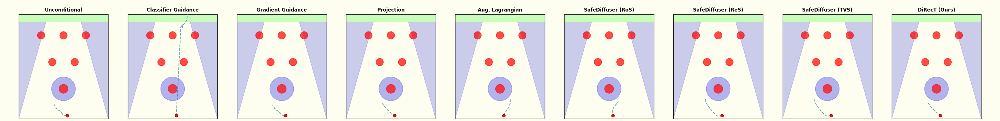

# Safe robotic manipulation in D3IL avoiding

This folder presents the benchmarks for _DiRecT_ and relevant baselines on the [D3IL](https://github.com/ALRhub/d3il) `avoiding-v0` navigation task with dynamics constraints. The agent must navigate upward through 6 circular pillar obstacles to reach a goal region while satisfying linearized dynamics and obstacle-avoidance constraints.


**Table of Contents**:
- [Installation](#installation)
- [Fit the linearized dynamics](#fit-the-linearized-dynamics)
- [Train the model](#train-the-model)
- [Evaluation](#evaluation)
- [Results](#results)
- [Code structure](#code-structure)
- [References](#references)

## Installation
> [!NOTE]
> The `avoiding-v0` environment uses MuJoCo 2.3.x via the `mujoco` Python bindings — no separate system-wide MuJoCo install is required. CasADi / IPOPT and Pinocchio are pulled in through conda-forge.

1. Change the CUDA and torch versions in `environment.yml` to ones compatible with your system requirements (default is CUDA 12.6 + torch 2.11).
2. Create and activate the conda environment. The provided `setup_env.sh` script handles environment creation, the `qpth` install (which needs `--no-build-isolation` due to a broken numpy specifier), and the `LD_LIBRARY_PATH` activation hook:
```bash
bash setup_env.sh
conda activate direct-d3il
```

## Fit the linearized dynamics
Fit a linear dynamics model `s_{t+1} = A·s_t + B·a_t + c` from the D3IL `avoiding-v0` expert trajectories (96 episodes). The fitted matrices are later imposed as linear constraints during planning.

```bash
python fit_dynamics.py \
    --env avoiding-v0                # gym env id (defaults to avoiding-v0)
```
Outputs (written to `logs/avoiding-v0/dynamics/`):
- `linear_model.npz` — fitted `A`, `B`, `c`, metadata, and normalizer (consumed by `eval.py`).
- `linear_model_predictions.png` — per-dimension true-vs-predicted scatter plot.
- `dynamics_verification.png` — single-step comparison against the real environment.
- `all_trajectories.png` — overlay of the expert dataset.

## Train the model
Train the unconstrained diffusion planner (Temporal U-Net, x_0-prediction parameterization with a cosine noise schedule) on the same D3IL dataset. Weights & Biases is used for logging (project `direct-d3il`).

```bash
python train.py \
    --exp-name x0pred \              # subfolder under <log-folder>/<env>/diffusion/
    --seed 0 \
    --batch-size 32 \                # overrides default 32
    --n-train-steps 1000001          # default 1M steps
```

Resume from the latest checkpoint with `--resume`. Checkpoints (raw + EMA weights), sample previews, and the resolved config are written to `logs/avoiding-v0/diffusion/<exp-name>/`:
- `model_*.pth`, `model_ema_*.pth` — saved every `--save-freq` steps (default 50k).
- `samples/step_*.png` — periodic sample previews from the EMA model.
- `tensorboard_logs/` — TensorBoard event files.
- `config.yaml` — snapshot of the fully-resolved config.

To submit as a SLURM job (edit the `#SBATCH` directives and conda env name first):
```bash
sbatch run.sbatch
```

## Evaluation
Evaluate any of the planning policies on the constrained `avoiding-v0` task. The trained diffusion weights and fitted dynamics are both required.

```bash
python eval.py \
    --diffusion-exp-name x0pred \    # which trained model to load
    --diffusion-cp 10 \              # checkpoint index (model_ema_<cp>.pth)
    --guidance-method direct \       # one of the methods listed below
    --constraints \                  # enable the obstacle constraint set
    --random-repeat 100 \            # number of evaluation rollouts
    --exp-name direct \              # subfolder under <log-folder>/<env>/eval/
    --seed 0 \
    --device cuda:0
```

Available planning policies (selected via `--guidance-method`): `no` (unconditional), `gradient`, `classifier`, `projection`, `safediffuser` (with `--cbf-algorithm {RoS,ReS,TVS}`), `primal-dual`, `augmented-lagrangian`, `direct`. The DiRecT method additionally supports `--pred-objective distance` to add a goal-distance objective in clean x_0 space.

To run the full sweep over every policy (dynamics constraint always on, 100 episodes each), use the provided SLURM script (edit the `#SBATCH` directives and conda env name first):
```bash
sbatch eval_all.sbatch
```

## Results
For each evaluation, results are written under `logs/avoiding-v0/eval/<exp-name>/`:
- `config.yaml` — resolved config used for the run.
- `runs.csv` — one row per rollout with per-run metrics (success, safety, steps, total constraint violations, total reward, average computation time per replan).
- `summary.json` — aggregated statistics (success rate, safety rate, average steps / violations / rewards / compute time).
- `all_real.png` — overlay of every closed-loop rollout on the obstacle field.
- `predictions/ep_*.png` — per-episode plot overlaying the diffused plans and the executed rollout.
- `trajectories.npz` — raw rollout state arrays (suppressed by `--no-trajectories`).

## Code structure
```
d3il/
├── d3il/                       # ported D3IL `avoiding-v0` environment + expert data (96 episodes)
│   └── environments/
├── datasets/
│   ├── sequence.py             # `SequenceDataset` (H=16 windows, LimitsNormalizer)
│   ├── buffer.py               # replay buffer over expert episodes
│   ├── normalization.py        # observation / action normalizers
│   └── preprocessing.py
├── policy/                     # planning policies (one file per method)
│   ├── unconditional.py        # baseline DDIM sampling
│   ├── gradient_guidance.py    # DPS-style posterior sampling
│   ├── classifier_guidance.py  # classifier guidance on noisy trajectory
│   ├── projected_diffusion.py  # IPOPT projection per denoising step (noisy space)
│   ├── safediffuser.py         # CBF-guided QP (RoS / ReS / TVS)
│   ├── augmented_lagrangian.py # primal-dual + augmented Lagrangian
│   ├── direct.py               # DiRecT: IPOPT projection in clean x_0 space
│   └── value_model.py          # differentiable proxy value function (obstacles + dynamics)
├── model.py                    # `TemporalUnet` + `CosineScheduleDiffusion` (x_0 parameterization)
├── projector.py                # `IpoptProjector` — CasADi/IPOPT constraint projection
├── obstacles.py                # circular & planar obstacles, constraint sets, violation checks
├── fit_dynamics.py             # fit `s_{t+1} = A s_t + B a_t + c` from offline data
├── train.py                    # train the diffusion planner
├── eval.py                     # rollout + metric aggregation for a chosen policy
├── utils/                      # rendering, array helpers, training utilities
├── run.sbatch                  # SLURM script for training
├── eval_all.sbatch             # SLURM script sweeping all 11 policies
├── setup_env.sh                # conda env bootstrap (incl. qpth + LD_LIBRARY_PATH hook)
└── environment.yml             # conda environment spec
```

## ✏️ Citation
If you find our code or paper useful for your research, please consider citing our work:
```
@misc{giaretta2026directsafediffusionbasedplanning,
      title={DiRecT: Safe Diffusion-Based Planning via Receding-Horizon Denoising}, 
      author={Paolo Giaretta and Zeyang Li and Navid Azizan},
      year={2026},
      eprint={2606.15359},
      archivePrefix={arXiv},
      primaryClass={cs.LG},
      url={https://arxiv.org/abs/2606.15359}, 
}
```

The `avoiding-v0` environment and expert data come from the D3IL benchmark:
```bibtex
@inproceedings{jia2024towards,
  title={Towards Diverse Behaviors: A Benchmark for Imitation Learning with Human Demonstrations},
  author={Xiaogang Jia and Denis Blessing and Xinkai Jiang and Moritz Reuss and Atalay Donat and Rudolf Lioutikov and Gerhard Neumann},
  booktitle={The Twelfth International Conference on Learning Representations},
  year={2024},
  url={https://openreview.net/forum?id=6pPYRXKPpw}
}
```

## References
- Michael Janner, Yilun Du, Joshua B. Tenenbaum, and Sergey Levine. Planning with diffusion for flexible behavior synthesis. In Proceedings of the 39th International Conference on Machine Learning, volume 162 of Proceedings of Machine Learning Research, pages 9902–9915, 2022.
- Prafulla Dhariwal and Alexander Nichol. Diffusion models beat gans on image synthesis. In Advances in Neural Information Processing Systems, volume 34, pages 8780–8794, 2021.
- Jacob K Christopher, Stephen Baek, and Ferdinando Fioretto. Constrained synthesis with projected diffusion models. Advances in Neural Information Processing Systems, 37:89307–89333, 2024.
- Wei Xiao, Tsun-Hsuan Wang, Chuang Gan, Ramin Hasani, Mathias Lechner, and Daniela Rus. Safediffuser: Safe planning with diffusion probabilistic models. In The Thirteenth International Conference on Learning Representations, 2025. URL https://openreview.net/forum?id=ig2wk7kK9J
- Jichen Zhang, Liqun Zhao, Antonis Papachristodoulou, and Jack Umenberger. Constrained diffusers for safe planning and control, 2025. URL https://arxiv.org/abs/2506.12544.
- Xiaogang Jia, Denis Blessing, Xinkai Jiang, Moritz Reuss, Atalay Donat, Rudolf Lioutikov, and Gerhard Neumann. Towards diverse behaviors: A benchmark for imitation learning with human demonstrations. In The Twelfth International Conference on Learning Representations, 2024.
