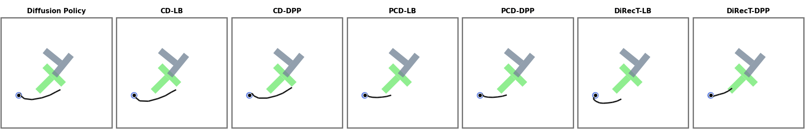

# Safe and diverse contact-rich manipulation in PushT

This folder presents the benchmarks for _DiRecT_, _PCD_, and relevant baselines on the contact-rich PushT manipulation task (multi-trajectory / coupled-sampling variant). The codebase is forked from the [**Projected Coupled Diffusion (PCD)**](https://github.com/EdmunLuad/pcd) [1] parent, which itself builds on the [Diffusion Policy](https://github.com/columbia-ai-robotics/diffusion_policy) framework of Chi et al. [2]. The diffusion backbone, the coupling-guidance machinery, the ADMM velocity projector, and the eval workspaces all come from the PCD parent. What is contributed here is the **DiRecT** policy on top, plus the full benchmark runner.



## What This Repo Adds/Modifies

Inherited from the PCD parent (and Diffusion Policy before it): the diffusion policy backbone `diffusion_policy/policy/diffusion_unet_lowdim_policy.py`, the cost-guided / projected variants `diffusion_unet_lowdim_{cost,proj,proj_coup}_policy.py`, the ADMM projector `diffusion_policy/model/projection/projection_operator.py`, the coupling-cost registry `diffusion_policy/coupling_cost/`, the PushT keypoints env runner and dataset, and the eval workspaces `eval_pcdiff_{cc,pj,pcd}_workspace.py`.

This fork adds **DiRecT** on top of PCD:
- New policy `diffusion_policy/policy/diffusion_unet_lowdim_direct_policy.py` (unguided diffusion + projection every step from `t_start_*`).
- New config `diffusion_policy/config/eval_H16_pusht_direct.yaml`.
- New `--direct` branch in `scripts/eval_H16_seq.py` (and `eval_H16_pusht_fix_init.py` / `eval_H16_pusht_guided_parallel.py`) routing to the DiRecT policy.
- New `scripts/run_benchmark.sh` driving all 11 methods (DP / CD-{DPP,LB} / CD-{DPP,LB}-PS / PCD-{DPP,LB} / PCD-{DPP,LB}-PS / DiRecT-{DPP,LB}) under shared hyperparameters.
- New analysis helpers `scripts/analyzing_results.py` + `config/analysis_config.yaml`.

**Table of Contents**
- [Installation](#installation)
- [Pretrained checkpoint and dataset](#pretrained-checkpoint-and-dataset)
- [Inference](#inference)
- [Full benchmark](#full-benchmark)
- [Analyzing results](#analyzing-results)
- [Code structure](#code-structure)
- [References](#references)

---

## Installation

### Requirements
- [miniconda](https://docs.conda.io/projects/miniconda/en/latest/index.html)
- CUDA 12.1 toolchain (the env pins `torch==2.1.2 + cu121`)

### Steps

1. Create and activate the conda env (named `direct-pusht` in `environment.yaml`):
    ```sh
    conda env create -f environment.yaml
    conda activate direct-pusht
    ```
2. Install the `diffusion_policy` package in editable mode:
    ```sh
    pip install -e .
    ```

---

## Pretrained checkpoint and dataset

**Training is not re-implemented in this fork.** The diffusion checkpoint we evaluate follows the LTLDoG [3] recipe on the augmented PushT replay buffer, exactly as described in the [PCD parent README](https://github.com/EdmunLuad/pcd) — see there for the data-augmentation script and the training command.

Place (or symlink) the artifacts so they are visible at:

```
pusht/
├── data/
│   ├── pretrained/diffusion/dp-H16O2A8D32.ckpt          # trained checkpoint
│   └── pusht/merged_pusht_cchi_v7_replay-seed_42r_33rf.zarr   # augmented dataset (needed for normalizer stats at inference)
```

The checkpoint we use (`dp-H16O2A8D32.ckpt`) has the following properties — all reproducible from `diffusion_policy/config/train_diffusion_unet_lowdim_workspace.yaml` + `task/pusht_lowdim.yaml`:

| Component | Value |
| --- | --- |
| Policy | `DiffusionUnetLowdimPolicy` (ConditionalUnet1D backbone) |
| Horizon `H` / obs steps `O` / action steps `A` | 16 / 2 / 8 |
| Diffusion steps `D` | 32 (DDPM, used at both train and inference) |
| `obs_dim` / `action_dim` / `keypoint_dim` | 20 / 2 / 2 (9 keypoints + agent state) |
| UNet | `down_dims=[256,512,1024]`, kernel 5, groups 8, step-embed 256, `cond_predict_scale=True` |
| Conditioning | `obs_as_global_cond=True` |
| Noise scheduler | DDPM, `squaredcos_cap_v2`, β=[1e-4, 0.02], `fixed_small`, `clip_sample=True`, ε-prediction |
| Optimizer | AdamW, lr `1e-4`, betas `(0.95, 0.999)`, wd `1e-6` |
| LR schedule | cosine, 500 warmup steps |
| EMA | `power=0.75`, `inv_gamma=1.0`, `max=0.9999` |
| Batch size | 256 |
| Training run length (config cap) | `num_epochs: 5000`, `max_train_steps: null` — the released checkpoint is an **earlier snapshot** from this run, picked per the top-k rule below |
| Checkpoint selection | top-k by `test_mean_score` (`mode: max`, `k=5`) + `save_last_ckpt: True`; see PCD upstream for the exact epoch used |
| Dataset | `merged_pusht_cchi_v7_replay-seed_42r_33rf.zarr` (LTLDoG-augmented PushT replay) |

---

## Inference

All methods are launched through `scripts/eval_H16_seq.py`. The CLI selects the guidance + projection combo; shared hyperparameters are passed as Hydra overrides.

Shared overrides used in the paper: `n_init_states=50 trial=200 n_diffusion_steps=32 v_max=8.4 group_size=2`.

Two coupling cost families are reported: **DPP** (`-c dpp`, determinantal point process diversity) and **LB** (`-c sum_log_l2`, sum-log-L2 log-barrier). The `scl` (gradient scale) and `stp` (guide steps) values below are the paper settings — they are also hard-coded in `scripts/run_benchmark.sh`.

```sh
conda activate direct-pusht
SHARED="n_init_states=50 trial=200 n_diffusion_steps=32 v_max=8.4 group_size=2"

# 1. DP — Diffusion Policy, unguided baseline
python scripts/eval_H16_seq.py -g vanilla  -p none         -m DP $SHARED

# 2. CD-DPP — coupling guidance, no projection, DPP cost
python scripts/eval_H16_seq.py -g coupling -p none         -c dpp        -m CD_DPP     $SHARED stp=1 scl=0.2

# 3. CD-LB — coupling guidance, no projection, log-barrier cost
python scripts/eval_H16_seq.py -g coupling -p none         -c sum_log_l2 -m CD_LB      $SHARED stp=1 scl=0.02

# 4. PCD-DPP — coupling guidance + ADMM velocity projection, DPP cost
python scripts/eval_H16_seq.py -g coupling -p max_vel_admm -c dpp        -m PCD_DPP    $SHARED stp=1 scl=2

# 5. PCD-LB — coupling guidance + ADMM projection, log-barrier cost
python scripts/eval_H16_seq.py -g coupling -p max_vel_admm -c sum_log_l2 -m PCD_LB     $SHARED stp=1 scl=0.2

# 6. DiRecT-DPP — guidance + projection active only for the last t<16 denoising steps, DPP cost
python scripts/eval_H16_seq.py -g coupling -p max_vel_admm -c dpp        --direct -m DiRecT_DPP $SHARED \
    stp=1 scl=0.05  t_start_guide=16 t_start_projection=16

# 7. DiRecT-LB — same schedule, log-barrier cost
python scripts/eval_H16_seq.py -g coupling -p max_vel_admm -c sum_log_l2 --direct -m DiRecT_LB  $SHARED \
    stp=1 scl=0.005 t_start_guide=16 t_start_projection=16
```

> PS (post-sampling) variants — `-g coupling_ps` for any of methods 2–5 — are run as part of the full benchmark below but omitted here for brevity.

Outputs land under `logs/tests/...`, one directory per method, with `eval_runs.log` and per-trial JSON / metrics inside.

---

## Full benchmark

To reproduce the full table (11 methods, fixed seeds and shared hyperparameters):

```sh
conda activate direct-pusht
bash scripts/run_benchmark.sh
```

The global parameters (`N_INIT_STATES`, `TRIAL`, `N_DIFFUSION_STEPS`, `V_MAX`, `GROUP_SIZE`, `EXP_NAME`) are at the top of the script — edit there to retarget.

---

## Analyzing results

```sh
python scripts/analyzing_results.py --config config/analysis_config.yaml
```

Edit `log_paths` in `config/analysis_config.yaml` to point at the run directories produced under `logs/tests/`. The analyzer aggregates success rate, coverage / DPP, and constraint-violation metrics across methods.

---

## Code structure

Only DiRecT-added and implementation-critical files are listed; everything else inherited from PCD / Diffusion Policy is omitted for brevity.

```
pusht/
├── diffusion_policy/
│   ├── policy/
│   │   ├── diffusion_unet_lowdim_policy.py                 # DP backbone (inherited)
│   │   ├── diffusion_unet_lowdim_cost_policy.py            # CD (inherited)
│   │   ├── diffusion_unet_lowdim_proj_policy.py            # Projection-only (inherited)
│   │   ├── diffusion_unet_lowdim_proj_coup_policy.py       # PCD (inherited)
│   │   ├── diffusion_unet_lowdim_postsamp_guide.py         # Post-sampling guidance (inherited)
│   │   └── diffusion_unet_lowdim_direct_policy.py          # NEW: DiRecT
│   ├── model/projection/projection_operator.py             # ADMM velocity projector (inherited)
│   ├── coupling_cost/                                      # DPP / log-barrier coupling costs
│   ├── workspace/eval_pcdiff_pcd_workspace.py              # eval workspace used by DiRecT + PCD
│   └── config/
│       ├── train_diffusion_unet_lowdim_workspace.yaml      # training config (params listed above)
│       ├── eval_H16_pusht_direct.yaml                      # NEW: DiRecT eval config
│       └── task/pusht_lowdim.yaml                          # PushT keypoints task
├── scripts/
│   ├── eval_H16_seq.py                                     # main eval CLI (PCD / DiRecT / baselines)
│   ├── eval_H16_pusht_fix_init.py                          # baseline eval sub-script
│   ├── eval_H16_pusht_guided_parallel.py                   # guided eval sub-script
│   ├── run_benchmark.sh                                    # NEW: full 11-method sweep
│   ├── analyzing_results.py                                # NEW: result aggregation
│   └── analysis_helpers.py                                 # NEW: analysis utilities
├── config/analysis_config.yaml                             # NEW: analyzer config
├── data/                                                   # checkpoint + augmented dataset (symlinked or downloaded)
├── environment.yaml                                        # conda env: direct-pusht
└── setup.py                                                # `pip install -e .`  →  package `diffusion_policy`
```

## ✏️ Citation
If you find our code or paper useful for your research, please consider citing our work:
```
@misc{giaretta2026directsafediffusionbasedplanning,
      title={DiRecT: Safe Diffusion-Based Planning via Receding-Horizon Denoising}, 
      author={Paolo Giaretta and Zeyang Li and Navid Azizan},
      year={2026},
      eprint={2606.15359},
      archivePrefix={arXiv},
      primaryClass={cs.LG},
      url={https://arxiv.org/abs/2606.15359}, 
}
```

## References
- [1] Hao Luan. Projected Coupled Diffusion (PCD). https://github.com/EdmunLuad/pcd
- [2] C. Chi, S. Feng, Y. Du, Z. Xu, E. Cousineau, B. Burchfiel, S. Song. Diffusion Policy: Visuomotor Policy Learning via Action Diffusion. RSS 2023. https://github.com/columbia-ai-robotics/diffusion_policy
- [3] Z. Feng, H. Luan, P. Goyal, H. Soh. LTLDoG: Satisfying Temporally-Extended Symbolic Constraints for Safe Diffusion-Based Planning. https://github.com/clear-nus/LTLDoG
